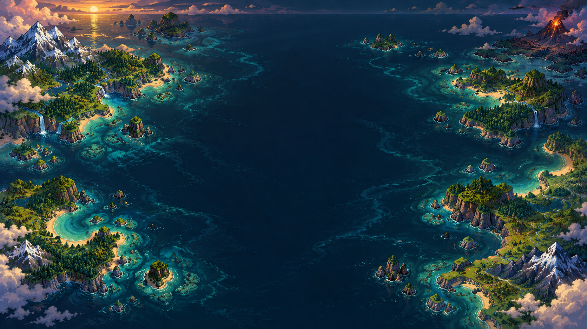

<div align="center">

# 🌍 WorldBox

### Пиксельная песочница, в которой рождаются миры, цивилизации и легенды

<p>
  
  
  
  
</p>

<p>
  Создавайте континенты, заселяйте их, вмешивайтесь в судьбы королевств —<br />
  или просто наблюдайте, как история пишется сама.
</p>

</div>



> WorldBox — неофициальный учебный проект и не связан с разработчиками оригинальной игры WorldBox.

## ✨ Что внутри

| Мир | Жизнь | Власть бога |
| :-- | :-- | :-- |
| Генерация континентов, архипелагов, Пангеи и островов | Жители добывают ресурсы, строят, стареют, создают семьи и осваивают профессии | Меняйте биомы, создавайте существ и ресурсы, управляйте кистью и историей действий |
| Биомы, высоты, вода, климат и дороги | Поселения вырастают в королевства, расширяют территорию, торгуют, воюют и заключают пакты | Молнии, метеориты, землетрясения, огонь, целебный дождь, щиты, магия и взрывчатка |
| Масштабы от `128 × 128` до `384 × 384` и воспроизводимые сиды | Животные, охота, приручение, фермы, загоны, корабли и прибрежные поселения | Инспектор объектов, политическая карта, журнал событий, мини-карта и хроники |

## 🚀 Быстрый старт

Для работы понадобится актуальная версия [Node.js](https://nodejs.org/) (рекомендуется LTS).

```bash
git clone <URL-вашего-репозитория>
cd WorldBox-React
npm install
npm run dev
```

После запуска откройте адрес, который покажет Vite — по умолчанию это [http://localhost:3000](http://localhost:3000).

### Другие команды

```bash
npm run lint    # проверка типов TypeScript
npm run build   # production-сборка в dist/
npm run preview # локальный просмотр production-сборки
```

## 🎮 Первые шаги

1. На стартовом экране задайте имя, размер, лимит населения и сид.
2. Выберите пресет мира: материки, архипелаг, Пангею или острова.
3. Добавьте поселенцев, деревья и камень — дальше цивилизация начнёт развиваться самостоятельно.
4. Откройте политическую карту, чтобы следить за границами и дипломатией королевств.
5. Экспериментируйте: помогайте миру божественными благословениями или проверяйте его на прочность катаклизмами.

### Управление

| Действие | Управление |
| :-- | :-- |
| Перемещение камеры | `W` `A` `S` `D`, пробел + перетаскивание или средняя кнопка мыши |
| Масштаб | Колесо мыши |
| Выбор объектов | `V` или рамка левой кнопкой мыши |
| Осмотр объекта | `I`, затем клик |
| Добавить человека | `H` · `Shift` + клик создаёт группу |
| Сменить биом | `B` |
| Ластик | `E` |
| Размер кисти | `[` / `]` |
| Пауза симуляции | Пробел или кнопка в панели |
| Отменить / повторить | `Ctrl` + `Z` / `Ctrl` + `Y` |
| Снять выделение | `Esc` |

## 🧭 Возможности симуляции

### Жители и цивилизации

- Жители ищут еду, добывают древесину и камень, строят дома, склады, ратуши, фермы и загоны.
- Поселения получают территорию, растут и при подходящих условиях формируют королевства.
- Королевства колонизируют новые земли, ведут войны, устанавливают отношения и заключают дипломатические пакты.
- У каждого выбранного жителя, здания, животного, поселения или королевства есть подробный инспектор.

### Природа и животные

- Доступны леса, ягоды и каменные залежи, а также биомы с разными условиями мира.
- В мире живут олени, кабаны, волки, куры и коровы. Животных можно приручать или использовать как источник пищи.
- Климат, высоты, рельеф, ресурсы и дорожная сеть учитываются в жизни мира.

### Инструменты бога

- **Созидание:** биомы, ресурсы, существа и здания.
- **Катаклизмы:** молния, метеорит, землетрясение и лесной пожар.
- **Благословения:** целебный дождь, божественный щит, омоложение и воинская ярость.
- **Магия и бомбы:** граната, напалм и заморозка.

## 💾 Сохранения и хроники

Мир можно сохранить в один из трёх локальных слотов браузера, а также экспортировать в JSON и позже импортировать обратно. В сохранение входят карта, жители, постройки, королевства, животные, ресурсы, корабли, история и климат.

> Локальные слоты хранятся в браузере. Очистка данных сайта удалит их — для важных миров используйте экспорт JSON.

## 🏗️ Устройство проекта

```text
src/
├── components/          # React-интерфейс: канвас, панели, мини-карта, инспекторы
│   └── ui/              # тулбар, меню, сохранения, журнал, подсказки
├── game/
│   ├── core/            # GameEngine — связь интерфейса и симуляции
│   ├── world/           # генерация мира, биомы, чанки, территории
│   ├── simulation/      # игровой цикл и автономное поведение мира
│   ├── entities/        # люди, животные и менеджеры сущностей
│   ├── kingdoms/        # поселения, королевства и экспансия
│   ├── diplomacy/       # отношения, войны и пакты
│   ├── powers/          # божественные силы и визуальные эффекты
│   ├── rendering/       # Canvas-рендерер и пиксельные спрайты
│   └── save/            # локальные сохранения и JSON-импорт/экспорт
├── assets/              # графика интерфейса
├── App.tsx              # точка входа приложения
└── main.tsx             # подключение React
```

## 🛠️ Стек

- **React 19** — интерфейс и состояние панелей.
- **TypeScript** — типобезопасная логика игры.
- **HTML5 Canvas** — отрисовка мира в реальном времени.
- **Vite** — быстрая разработка и сборка.
- **Tailwind CSS** и **Lucide** — стили и иконки интерфейса.

## 🤝 Разработка

Будем рады улучшениям. Перед отправкой изменений проверьте проект:

```bash
npm run lint
npm run build
```

Если вы добавляете механику, постарайтесь разделить интерфейс, рендеринг и симуляционную логику — так мир останется проще развивать и балансировать.

---

<div align="center">
  <b>Создайте мир. Запустите время. Посмотрите, что останется в истории.</b>
</div>
